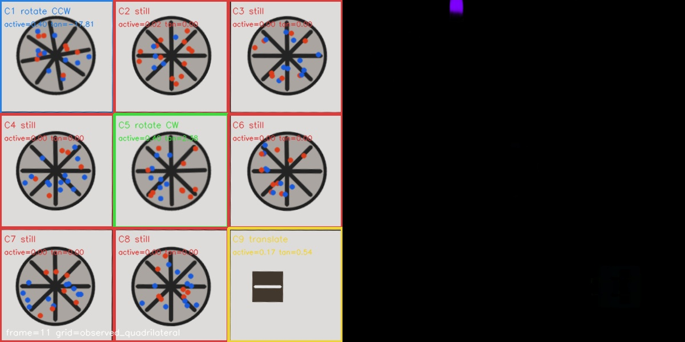

# Grid Motion & Rotation Lab

[](https://github.com/cagataykavas/rotationDetector/actions/workflows/ci.yml)

An explainable optical-flow pipeline for measuring activity in a rectified grid. It
distinguishes coherent clockwise/counter-clockwise tangential flow from translation,
aggregates frame decisions into time intervals, and evaluates interval predictions
against a documented reference contract.

The repository is a production-minded repair of a university prototype. The original
290-line script is preserved under [`legacy/HW2_monolith.py`](legacy/HW2_monolith.py)
and is not imported by the application.



_Generated integration scene: opposite rotor directions in cells 1 and 5,
translation in cell 9, and dense-flow visualization._

## What it demonstrates

- automatic board quadrilateral detection with explicit full-frame fallback
- perspective rectification into a configurable canonical grid
- dense Farneback optical flow and per-cell motion masks
- radial/tangential vector decomposition for rotation direction
- configurable cell-ID layouts, including the historical robot mapping
- interval aggregation, reference scoring, explainable JSON, and annotated video
- deterministic generated demo, tests, linting, and headless CI

This is a transparent classical-CV baseline. Flow scores and synthetic observations
are not claims of real-world model accuracy.

## Quick start

```bash
python -m venv .venv
source .venv/bin/activate
pip install -e ".[dev]"

# Generates a perspective board with two rotors and one translating marker.
grid-motion demo --output artifacts/demo --frames 48

# Analyze a real grid recording.
grid-motion analyze --input test1.mp4 --output artifacts/test1

# Compare interval decisions with a labeled reference file.
grid-motion evaluate \
  --predictions artifacts/test1/intervals.json \
  --reference reference.example.json

grid-motion explain-schema
```

The historical filename remains a compatibility entry point:

```bash
python HW2.py demo --output artifacts/demo
```

## Outputs

| File | Purpose |
|---|---|
| `events.jsonl` | Per-frame cell motion and rotation evidence |
| `intervals.json` | Per-second moving/not-moving decisions and dominant states |
| `summary.json` | Input metadata, timings, configuration, and state counts |
| `annotated.mp4` | Rectified grid next to a dense-flow visualization |
| `preview.jpg` | Final annotated frame |

Example cell event:

```json
{
  "cell_id": 1,
  "state": "rotating_clockwise",
  "moving": true,
  "mean_magnitude": 1.42,
  "active_pixel_fraction": 0.31,
  "translation_magnitude": 0.08,
  "mean_tangential_velocity": 1.17,
  "tangential_coherence": 0.82,
  "evidence": {
    "decision_rule": "coherent_tangential_flow",
    "pixel_motion_threshold": 0.35,
    "rotation_velocity_threshold": 0.18
  }
}
```

See [Architecture](docs/architecture.md), [JSON contract](docs/json-contract.md),
[Evaluation](docs/evaluation.md), and [Legacy migration](docs/legacy-migration.md).

## Configuration

```bash
cp config.example.json my-grid.json
grid-motion analyze \
  --input test1.mp4 \
  --output artifacts/test1 \
  --config my-grid.json \
  --max-frames 900
```

To retain the original assignment's physical robot numbering, use:

```json
{"cell_ids": [7, 1, 4, 8, 2, 5, 9, 3, 6]}
```

Unknown keys, duplicate cell IDs, and invalid thresholds fail before processing.

## Development

```bash
pip install -e ".[dev]"
ruff check .
pytest
grid-motion demo --output artifacts/smoke --frames 16 --no-video
```

## Limitations

- Automatic board detection expects a large, high-contrast planar region.
- Dense optical flow is sensitive to blur, flicker, shadows, and camera motion.
- Rotation direction is inferred from image-plane flow, not physical angular velocity.
- The first processed frame is a warm-up frame with no flow decision.
- Deployment thresholds require representative labeled recordings and a fixed camera.

## License

MIT
