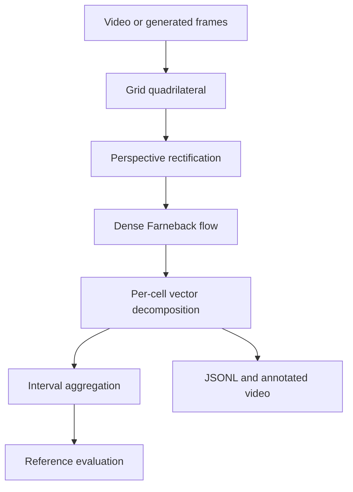

# Architecture

The repaired pipeline makes the grid transform, flow measurements, frame decisions,
and interval decisions separate and testable.

## Modules

| Module | Responsibility |
|---|---|
| `config.py` | Validate grid, flow, state, and interval parameters |
| `geometry.py` | Detect and rectify the planar board |
| `analysis.py` | Calculate flow and classify each cell |
| `aggregation.py` | Aggregate frames and score reference decisions |
| `pipeline.py` | Handle video/artifact I/O without a GUI |
| `demo.py` | Generate a perspective board with known motion types |
| `cli.py` | Expose analysis, demo, evaluation, and contract commands |

## Grid localization

The first processed frame is blurred and Otsu-thresholded. After morphological closing,
the largest convex four-corner contour above `grid_min_area_ratio` becomes the board.
Corners are ordered top-left, top-right, bottom-right, bottom-left and mapped to the
canonical grid.

If no valid board exists, the system uses the full frame and emits
`source: full_frame_fallback` with confidence `0`. This is visible in every event and
summary; fallback is never presented as a successful board detection.

## Cell flow

Dense Farneback flow produces a 2D velocity vector at every canonical pixel. For each
cell, the analyzer records:

- mean vector magnitude;
- fraction of pixels above `pixel_motion_threshold`;
- magnitude of the mean active-flow vector (translation evidence);
- signed tangential velocity around the cell center;
- mean absolute tangential velocity; and
- tangential coherence, `abs(mean tangent) / mean(abs(tangent))`.

In image coordinates, positive signed tangential velocity is defined as clockwise.
This is an image-plane convention, not a physical angular-velocity measurement.

## State decision

1. Too few active pixels → `stationary`.
2. Sufficient tangent magnitude and coherence → clockwise or counter-clockwise
   rotation.
3. Sufficient mean-vector magnitude → `translating`.
4. Remaining active, non-coherent flow → `complex_motion`.

The first frame is `warmup` because optical flow requires a previous image. Each cell
event stores the rule and all thresholds.

## Interval decision

Frames are grouped by `interval_seconds`. A cell is moving in an interval when its
moving-frame fraction reaches `interval_active_frame_fraction`. The dominant state is
the most common moving state in that interval. This explicitly replaces the original
script's hard-coded 60-second matrix and implicit frame-count threshold.

## Extension points

- Supply a stabilized video or add camera-motion compensation before Farneback flow.
- Replace automatic board detection with calibrated fixed corners for production.
- Substitute RAFT or another learned flow estimator while preserving `CellMotion`.
- Add confidence intervals and class-specific state evaluation to `aggregation.py`.
